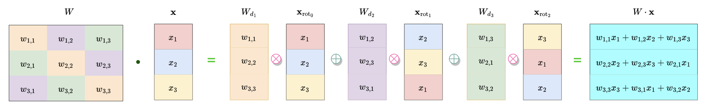
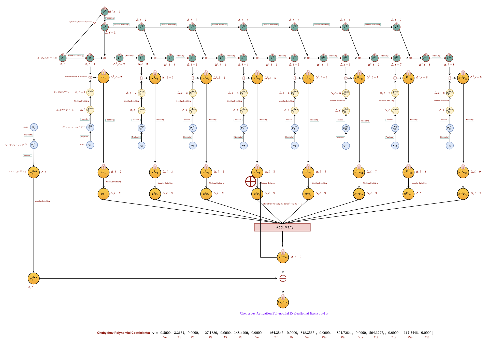

# Cryptoforest

Cryptoforest is an implementation of homomorphic neural random forest which is homomorphic evaluation of [Neural Random Forest](https://arxiv.org/pdf/1604.07143.pdf). For implementation, we use homomorphic encryption library [Microsoft SEAL](https://github.com/microsoft/SEAL). Cryptoforest uses [CKKS](https://eprint.iacr.org/2016/421.pdf) encryption scheme which is implemented in SEAL to support homomorphic evaluation for approximate arithmatic. 

## Contents

- [Getting started](#getting-started)
  - [Installing Microsoft SEAL](#installing-microsoft-seal)
  - [Running the codes](#running-the-codes)
  - [Running the tests](#running-the-tests)
  - [Examples](#examples)
- [Plaintext Matrix-Ciphertext Vector Multiplication](#plaintext-matrix-ciphertext-vector-multiplication)
- [Chebyshev Polynomial Activation Function](#chebyshev-polynomial-activation-functio)
- [Contributing](#contributing)
- [License](#license)
- [Authors](#authors)
- [Acknowledgments](#acknowledgments)

## Getting started
First install the Visual Studio 2022 with C++ CMake Tools for Windows, Clang++ (>= 5.0) or GNU G++ (>= 6.0), CMake (>= 3.13) and Xcode toolchain (>= 9.3), CMake (>= 3.13) for Windows, Linux and MacOS, respectively before installing [Microsoft SEAL](https://github.com/microsoft/SEAL) library.
### Installing Microsoft SEAL

Install SEAL globally if you have root permission as follows (For details regarding installation, please refer to https://github.com/microsoft/SEAL):

```PowerShell
cmake -S . -B build
cmake --build build
sudo cmake --install build
```
### Running the codes
To use the code, run as following:
```PowerShell
git clone https://mishra_pradeep@bitbucket.org/tiicrypto/tii-cryptoforest.git
cd tii-cryptoforest
cmake .
make
./cryptoforest
```
### Running the tests

Pending

### Examples

Pending

```
Give an example
```

## Plaintext Matrix-Ciphertext Vector multiplication
Check the following diagram to see how matrix-vector multiplication works if vector is encrypted. This method was proposed by [Halevi and Shoup](https://www.shoup.net/papers/helib.pdf). 



## Chebyshev Polynomial Activation Function
We use Chebyshev polynomial approximation for the activation function used in cryptoforest and can be well understood it evaluation over encrypted data by the following diagram:


## Contributing

---


## Authors

---


## License

---

## Acknowledgments

---
